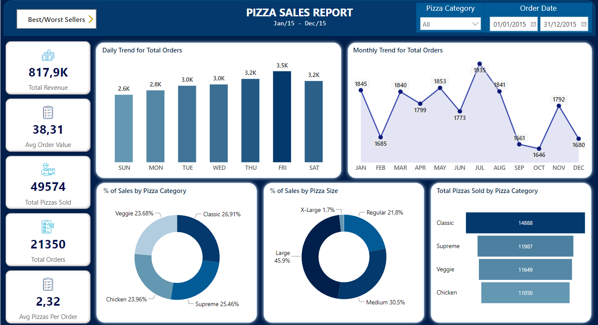

# pizzaria_sales_powerBI
The project started simply as an Excel spreadsheet with no treatments. From there, all the data was modeled and inserted into two tables of a SQL Database. The tables are named 'pizza' and 'order' and have the appropriate relationships.

The database was also utilized in SQL Server Management Studio (SSMS) to execute queries for validating the data that would be presented on the dashboard.

Finally, the data was imported into Power BI, transformed with DAX formulas, and then loaded into a dashboard that presents information such as total revenue, average order value, and pizzas per order, daily and monthly trends for total orders, percentage of sales by pizza category and size, top and bottom pizzas by revenue, orders, and quantity, and more.

The dashboard allows stakeholders to use various filters, including date range, month, day of the week, pizza category, size, specific pizzas, and more. The charts respond to any filter applied to the dashboard, providing valuable business insights and supporting decision-making.

## Technologies Used
- Power BI
- T-SQL
- SQL Server Management Studio (SSMS)
- Excel

## Features
- KPI (Key Performance Indicator)
- Charts: Stacked column, area, donut, funnel, and stacked bar
- Slicers with date range and pizza category selection
- Screen navigation
- Modeled database
- SQL queries for data validation

## Screenshots

  
   
   
  
   
   
  

## Acknowledgements
Special thanks to Alon Pinheiro from the YouTube channel 'Hashtag Treinamentos' for introducing me to Power BI's basic features and to Swapnjeet S from the YouTube channel 'Data Tutorials' for teaching me how to create the presented dashboard.
